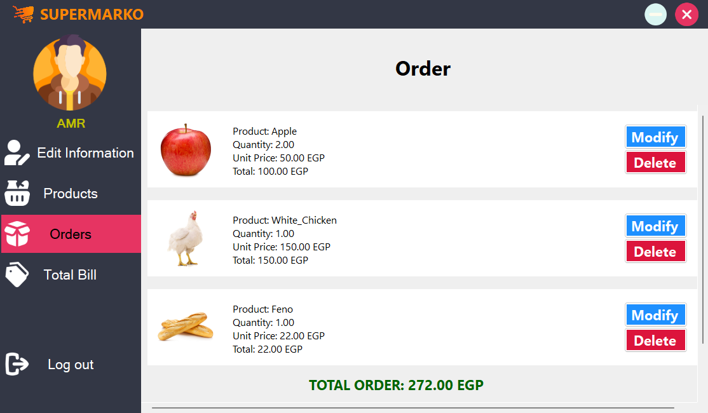
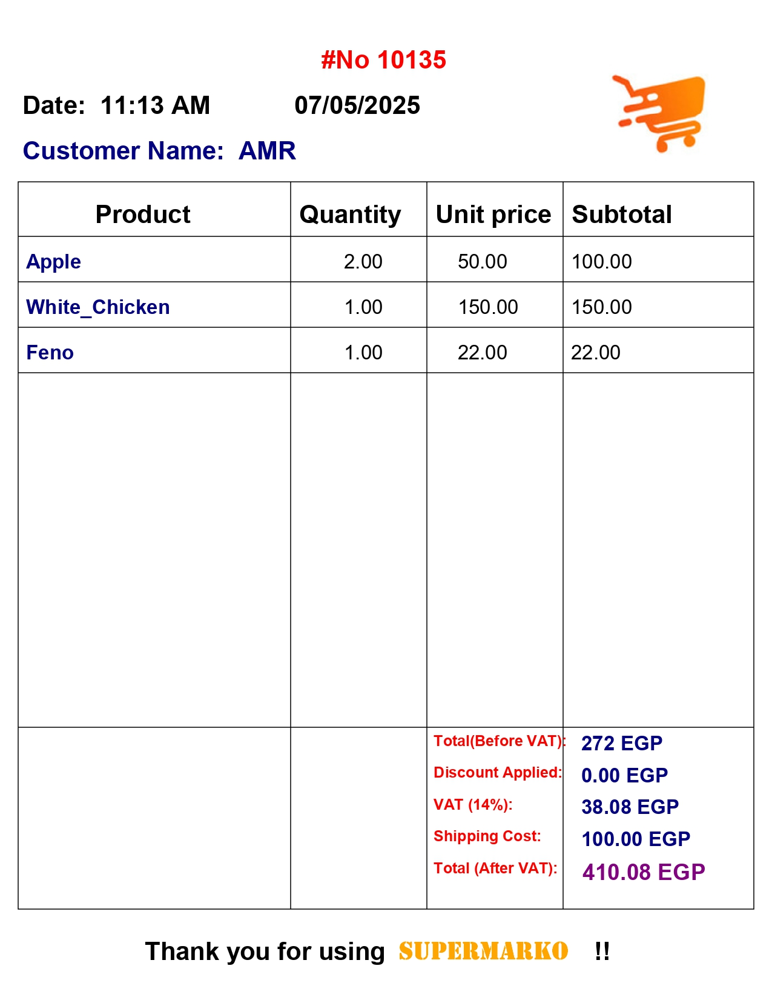

# 🛒 Supermarko GUI

---

## 🎞 Demo

---

## 📝 Overview

**Supermarko GUI** is the graphical version of the Supermarko supermarket shopping system, built with **C++ WinForms**. This version transforms the terminal-based experience into a modern, user-friendly application with smooth UI, clear navigation, and intuitive workflows for shopping, order management, and billing.

---

## ✨ Features

- 🔐 **Login & Register**: Secure and simple account handling.
- 🧠 **Input Validations**: Prevents incorrect or invalid data entries.
- 🧭 **Start Screen**: Clean and welcoming intro screen for better onboarding.
- 🛍️ **Product Catalog**: Browse and select items from categorized product lists.
- 🛒 **Order Management**: Add, remove, and update products in your cart.
- 💰 **View Total Bill**: See your real-time total while shopping.
- 🧾 **Print Receipt**: Generate and print a professional bill after checkout.
- 🎉 **End Screen**: Thank-you screen with confirmation of purchase.
- 🎨 **Beautiful UI/UX**: Designed with clarity, contrast, and modern styling in mind.

---

## 🛠 Technologies Used

- 💻 **Programming Language**: C++
- 🖼 **Framework**: WinForms for GUI
- 🗃 **Data Structures**: Structs & Arrays
- 🔁 **Functions**: Modular logic with pass-by-value and pass-by-reference

---

## 🛍 Customer Functions

✔️ **Log in / Register**  
✔️ **Start screen with navigation options**  
✔️ **View products by category**  
✔️ **Add items to cart**  
✔️ **Edit or remove items from the order**  
✔️ **View live total bill**  
✔️ **Print your receipt**  
✔️ **End screen with summary and thanks**  
✔️ **Log out and return to start**

---

## 👨‍💻 Team Members

1. 🏅 Amr Khaled Hassan Morcy  
2. 🏅 Omar Mohammed Abdelmoaty  
3. 🏅 Mahmoud Mohammed AbdelSalam  
4. 🏅 Mohammed Gamal Abbas  
5. 🏅 Mohanad Refaye Hussein  
6. 🏅 Essam Mohammed El-Shahat  

---

## 📸 Screenshots

Explore the sleek and user-friendly interface of **Supermarko GUI**, crafted with C++ and WinForms for a smooth shopping experience.

---

### 🟢 Start Screen  

---

### 🔐 Login Screen  

---

### 📝 Register Screen  

---

### 🏠 Default Home Screen  

---

### ✏️ Edit User Information  

---

### 🗂 Product Categories  

---

### 📦 Product List  

---

### 🛒 Current Order View  

---

### 💰 Total Bill Summary  

---

### 🎉 Thank You / End Screen  

---

### 🧾 Printable Bill View  

---

## 📄 License

This project is licensed under the MIT License.
