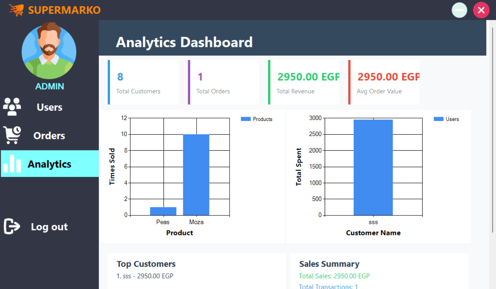
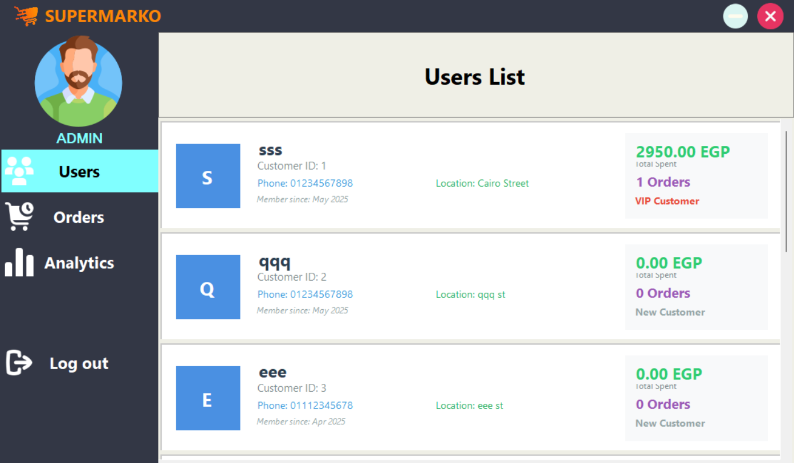
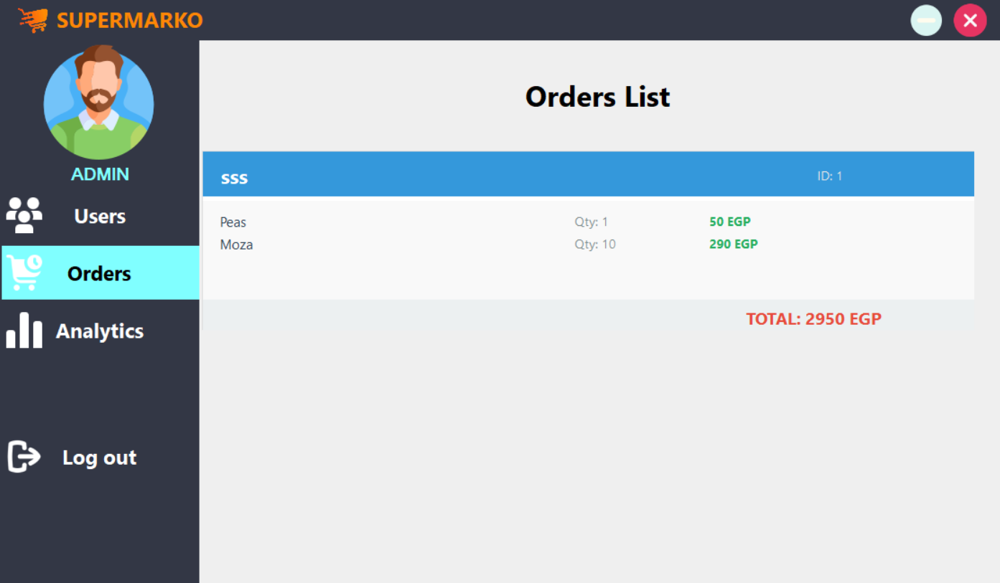
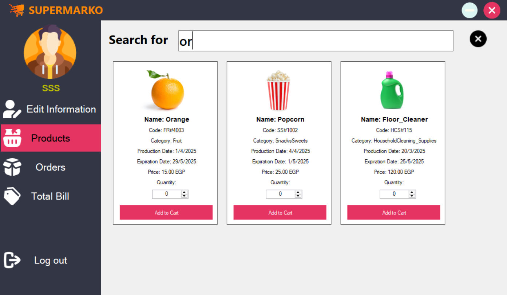

# 🛒 Supermarko GUI

---

## 🎞 Demo

---

## 📝 Overview

**Supermarko GUI** is the graphical version of the Supermarko supermarket shopping system, built with **C++ WinForms**. This comprehensive application transforms the terminal-based experience into a modern, user-friendly system with smooth UI, clear navigation, and intuitive workflows for shopping, order management, and billing. The system includes both customer-facing features and a powerful admin panel with analytics, user management, and business intelligence capabilities.

---

## ✨ Features

- 🔐 **Login & Register**: Secure and simple account handling.
- 🧠 **Input Validations**: Prevents incorrect or invalid data entries.
- 🧭 **Start Screen**: Clean and welcoming intro screen for better onboarding.
- 🛍️ **Product Catalog**: Browse and select items from categorized product lists.
- 🛒 **Order Management**: Add, remove, and update products in your cart.
- 💰 **View Total Bill**: See your real-time total while shopping.
- 🧾 **Print Receipt**: Generate and print a professional bill after checkout.
- 🎉 **End Screen**: Thank-you screen with confirmation of purchase.
- 🔍 **Advanced Search**: Modern search system with filters and real-time results.
- 👑 **Admin Panel**: Comprehensive administrative dashboard with analytics and user management.
- 📊 **Analytics Dashboard**: Real-time sales data, charts, and business insights.
- 👥 **User Management**: View user lists with status (New, Regular, Premium, VIP).
- 📋 **Order Tracking**: Complete order history with user details and total pricing.
- 🎨 **Beautiful UI/UX**: Designed with clarity, contrast, and modern styling in mind.

---

## 🛠 Technologies Used

- 💻 **Programming Language**: C++
- 🖼 **Framework**: WinForms for GUI
- 🗃 **Data Structures**: Structs & Arrays
- 🔁 **Functions**: Modular logic with pass-by-value and pass-by-reference
- 📊 **Analytics**: Real-time data visualization and business intelligence
- 🎨 **Modern UI**: Advanced search system with filters and responsive design

---

## 🛍 Customer Functions

✔️ **Log in / Register**  
✔️ **Start screen with navigation options**  
✔️ **View products by category**  
✔️ **Search products with advanced filters**  
✔️ **Add items to cart**  
✔️ **Edit or remove items from the order**  
✔️ **View live total bill**  
✔️ **Print your receipt**  
✔️ **End screen with summary and thanks**  
✔️ **Log out and return to start**

---

## 👑 Admin Functions

✔️ **Admin Dashboard Access**  
✔️ **Analytics & Business Intelligence**

- 📊 Real-time sales charts and graphs
- 💹 Revenue tracking and trends
- 📈 Product performance metrics  
  ✔️ **User Management System**
- 👥 Complete user list with profiles
- 🏷️ User status classification (New, Regular, Premium, VIP)
- 📊 Order count per user
- 👤 User activity tracking  
  ✔️ **Order Management**
- 📋 Comprehensive order history
- 🔍 Filter orders by user
- 💰 Total price calculations
- 📅 Order date and status tracking  
  ✔️ **System Analytics**
- 📊 Sales performance dashboards
- 📈 Customer behavior insights
- 💼 Business intelligence reports

---

## 🎯 User Classification System

The admin panel includes an intelligent user classification system that automatically categorizes users based on their shopping behavior:

### 👤 **User Types**

- 🆕 **New User**: Recently registered, fewer than 3 orders
- 🛒 **Regular User**: 3-10 orders, moderate shopping frequency
- ⭐ **Premium User**: 11-25 orders, frequent shopper with higher spending
- 💎 **VIP User**: 25+ orders, top-tier customer with highest value

### 📊 **Admin Analytics Features**

- **Sales Dashboard**: Real-time revenue tracking with interactive charts
- **User Insights**: Customer behavior analysis and segmentation
- **Order Analytics**: Comprehensive order history with filtering capabilities
- **Performance Metrics**: Product popularity and sales trends
- **Revenue Reports**: Detailed financial analytics and projections

### 🔧 **Admin Management Tools**

- **User List Management**: View all users with their classification and order history
- **Order Tracking**: Monitor all customer orders with detailed breakdowns
- **System Analytics**: Business intelligence dashboard for decision making
- **Data Visualization**: Charts and graphs for better insight presentation

---

## 👨‍💻 Team Members

1. 🏅 Amr Khaled Hassan Morcy
2. 🏅 Omar Mohammed Abdelmoaty
3. 🏅 Mahmoud Mohammed AbdelSalam
4. 🏅 Mohammed Gamal Abbas
5. 🏅 Mohanad Refaye Hussein
6. 🏅 Essam Mohammed El-Shahat

---

## 📸 Screenshots

Explore the sleek and user-friendly interface of **Supermarko GUI**, crafted with C++ and WinForms for a smooth shopping experience.

---

### 🟢 Start Screen

---

### 🔐 Login Screen

---

### 📝 Register Screen

---

### 🏠 Default Home Screen

---

### ✏️ Edit User Information

---

### 🗂 Product Categories

---

### 📦 Product List

---

### 🛒 Current Order View

---

### 💰 Total Bill Summary

---

### 🎉 Thank You / End Screen

---

### 🧾 Printable Bill View

---

### 👑 Admin Panel Screenshots

---

### 📊 Analytics Dashboard

---

### 👥 User Management Panel

---

### 📋 Order Management System

---

### 🔍 Advanced Search System

---

## 📄 License

This project is licensed under the MIT License.
